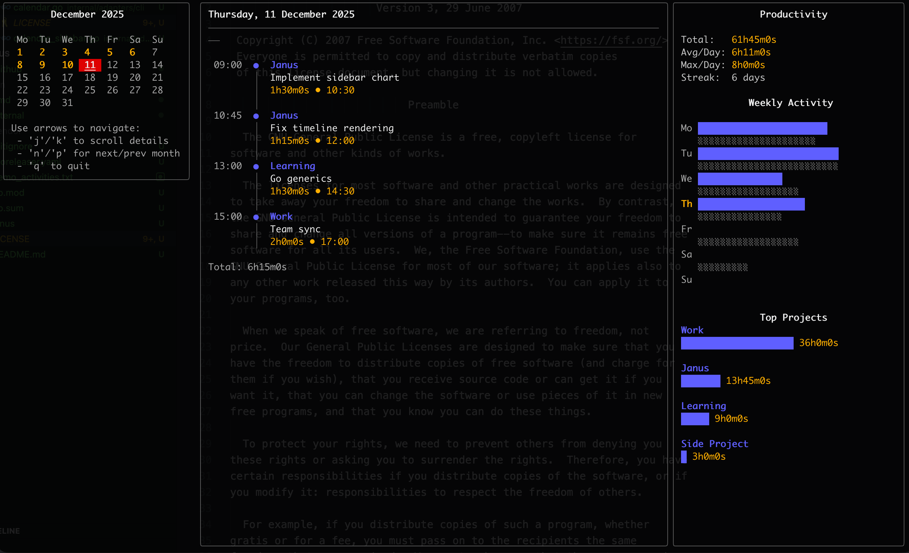
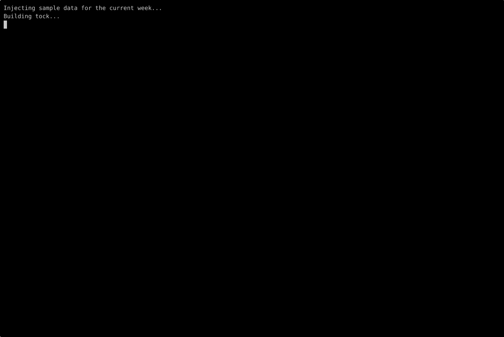
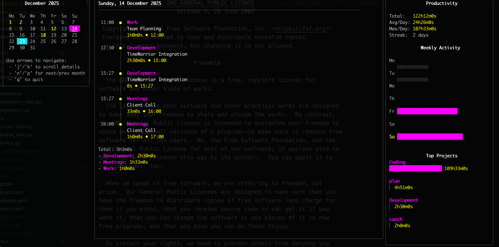
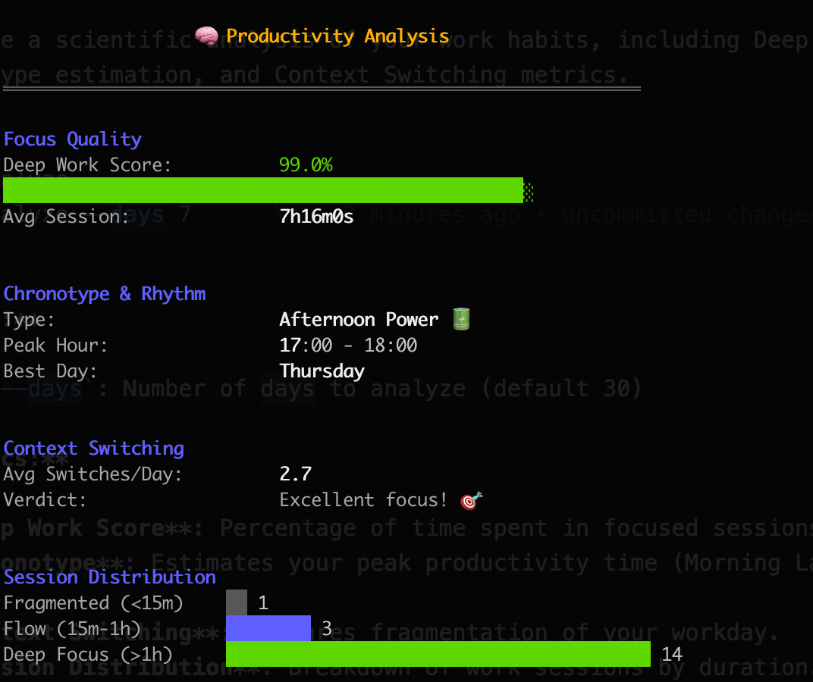

# Tock

<p align="center">
  <a href="https://github.com/kriuchkov/tock/releases">
    
  </a>
  <a href="LICENSE">
    
  </a>
  <a href="https://github.com/kriuchkov/tock/stargazers">
    
  </a>
  <a href="go.mod">
    
  </a>
  <a href="https://github.com/kriuchkov/tock/actions">
    
  </a>
  <a href="docs/openclaw.md">
    
  </a>
</p>

<p align="center">
  <a href="#features"><strong>Features</strong></a>
  <span>&nbsp;•&nbsp;</span>
  <a href="#quick-start"><strong>Quick Start</strong></a>
  <span>&nbsp;•&nbsp;</span>
  <a href="#commands"><strong>Commands</strong></a>
  <span>&nbsp;•&nbsp;</span>
  <a href="#openclaw"><strong>OpenClaw</strong></a>
  <br />
  <a href="#configuration"><strong>Configuration</strong></a>
  <span>&nbsp;•&nbsp;</span>
  <a href="#theming"><strong>Theme</strong></a>
  <span>&nbsp;•&nbsp;</span>
  <a href="#file-format"><strong>File Format</strong></a>
  <span>&nbsp;•&nbsp;</span>
  <a href="#shell-completion"><strong>Shell</strong></a>
  <span>&nbsp;•&nbsp;</span>
  <a href="#inspiration"><strong>Inspiration</strong></a>
  <span>&nbsp;•&nbsp;</span>
  <a href="#license"><strong>License</strong></a>
</p>

## Features



**Tock** is a powerful time tracking tool for the command line. It saves activity logs as plaintext files and provides an interactive terminal UI for viewing your time.

Features include:

- **Simple plaintext format** - Activities stored in human-readable files (default)
- **Multiple Backends** - Support for flat files, TodoTXT, TimeWarrior, and SQLite databases
- **Notes & Tags** - Attach detailed notes and tags to activities
- **Interactive TUI** - Beautiful terminal calendar view using Bubble Tea
- **Fast & Lightweight** - Single binary, no dependencies
- **Compatible** - Reads/writes Bartib file format, TodoTXT-compatible lines, and TimeWarrior data files
- **Customizable Themes** - Multiple color themes and custom color support
- **Report Export** - Export report data as text, CSV, or JSON
- **iCal Export** - Generate .ics files for calendar integration, or sync with system calendars (macOS only)

<hr clear="right"/>

## Quick Start

### Installation

#### Homebrew (macOS)

```bash
# https://formulae.brew.sh/formula/tock
# Install from official repository (build from source)
brew install tock

# Install pre-built binary via latest release (Goreleaser)
brew install kriuchkov/tap/tock
```

#### Go Install

```bash
go install github.com/kriuchkov/tock/cmd/tock@latest
```

#### Build from source

```bash
go build -o tock ./cmd/tock
```

#### Install Script (Linux & macOS)

```bash
curl -sS https://raw.githubusercontent.com/kriuchkov/tock/master/install.sh | sh
```

#### Download Binary

Download the latest release from the [Releases](https://github.com/kriuchkov/tock/releases) page.

### Basic Usage


<hr clear="right"/>

Start tracking time:

```bash
tock start # Interactive mode (requires no arguments)
tock start "My Project" "Implementing features" # Quick start with arguments
tock start "My Project" "Implementing features" "Some notes" "tag1,tag2"  # Quick start with arguments + notes/tags
tock start -d "Implementing features" -p "My Project" # Start with flags
tock start -d "Implementing features" -p "My Project" -t 14:30 --note "Some notes" --tag "afternoon" # Start with flags + time + notes/tags
```

Stop the current activity:

```bash
tock stop # Stop now
tock stop -t 17:00 # Stop at specific time
tock stop --note "Finished for the day" # Stop with a note
tock stop --tag "end-of-day" # Stop with a tag
```

Continue a previous activity (Create a new entry with the same project/description):

```bash
tock continue  # Continue the last activity
tock continue 1   # Continue the 2nd to last activity
tock continue -d "New" # Continue last activity but with new description
tock continue -p "New Project" # Continue last activity but with new project
tock continue -t 14:00 # Continue last activity but with specific start time
tock continue --note "Resuming work" --tag "resumed" # Continue last activity with a note and tag
```

View activities in interactive calendar:

```bash
tock list
```

Calendar controls:

- `Arrow Keys` / `h,j,k,l`: Navigate days
- `n`: Next month
- `p`: Previous month
- `q` / `Esc`: Quit

```bash
tock calendar
```


## Configuration

Tock supports a flexible configuration system using YAML files and environment variables.

**Priority Order:**

1. Command-line flags
2. Environment variables
3. Configuration file (`~/.config/tock/tock.yaml` or `./tock.yaml`)
4. Default values

### Configuration File

Example `tock.yaml`:

```yaml
backend: file
file:
    path: /Users/user/tock.txt
todotxt:
  path: /Users/user/todo.txt
sqlite:
    path: /Users/user/tock.db
time_format: "24"
theme:
    faint: '#404040'
    highlight: '#FFFF00'
    name: custom
    primary: '#FF00FF'
    secondary: '#00FFFF'
    sub_text: '#B0B0B0'
    text: '#FFFFFF'
timewarrior:
    data_path: /Users/user/.timewarrior/data
  use_tock_tag_colors: true
  use_tock_tag_colors_calendar: true
  use_tock_tag_colors_weekly_activity: true
  use_tock_tag_colors_top_projects: true
working_hours:
  enabled: true
  stop_at: "17:30"
  weekdays: "mon,tue,wed,thu,fri"
calendar:
    time_spent_format: "15:04"
    time_start_format: "15:04"
    time_end_format: " • 15:04"
export:
    ical:
        file_name: "tock_export.ics"
weekly_target: "40h"
check_updates: true
```

When `working_hours.enabled` is `true`, tock will automatically stop the latest running activity at `working_hours.stop_at` the next time you run a command after that cutoff. The feature is disabled by default.

You can specify a custom config file path with the `--config` flag:

```bash
tock --config /path/to/tock.yaml list
```

Example a config file [tock.yaml.example](tock.yaml.example).

### Environment Variables

All settings can be overridden with environment variables (prefix `TOCK_`).

- `TOCK_BACKEND`: `file`, `todotxt`, `timewarrior`, or `sqlite`
- `TOCK_EXPORT_ICAL_FILE_NAME`: Custom filename for bulk iCal export (default: `tock_export.ics`)
- `TOCK_FILE_PATH`: Path to activity log
- `TOCK_TODOTXT_PATH`: Path to TodoTXT activity log
- `TOCK_TIME_FORMAT`: Time display format (`12` or `24`)
Notes are stored as individual files in `~/.tock/notes/` (or relative to your configured file path).

- `TOCK_THEME_NAME`: Theme name (`dark`, `light`, `custom`)
- `TOCK_WEEKLY_TARGET`: Weekly workload target as a duration (e.g., `40h`, `37h30m`)
- `TOCK_CHECK_UPDATES`: Check for updates (default: `true`)

### Storage Backends

Tock supports multiple storage backends.

## OpenClaw

Tock includes a workspace-ready OpenClaw skill in `skills/tock`.

This integration model uses the local `tock` CLI instead of coupling Tock to OpenClaw internals. For agent-safe flows, use machine-readable commands where possible:

```bash
tock current --json
tock last --json -n 10
tock export --today --format json --stdout
tock start -p "Backend" -d "Implement OpenClaw skill" --json
tock stop --json
```

Setup details are documented in [docs/openclaw.md](docs/openclaw.md).

### 1. Flat File (Default)

Stores activities in a simple plaintext file.

```bash
export TOCK_FILE_PATH="$HOME/.tock.txt"
```

### 2. TodoTXT

Stores activities in a TodoTXT-compatible file. Tock keeps exact timestamps and full field fidelity in `tock_*` key:value extensions, so round-tripping remains lossless even though base TodoTXT has date-only task metadata.

```bash
# Enable TodoTXT backend
export TOCK_BACKEND="todotxt"

# Optional: Specify custom TodoTXT file path (default: ~/.tock.todo.txt)
export TOCK_TODOTXT_PATH="$HOME/.tock.todo.txt"
```

### 3. TimeWarrior

Integrates with [TimeWarrior](https://timewarrior.net/) data files.

```bash
# Enable TimeWarrior backend
export TOCK_BACKEND="timewarrior"

# Optional: Specify custom data directory (default: ~/.timewarrior/data)
export TOCK_TIMEWARRIOR_DATA_PATH="/path/to/timewarrior/data"

# Optional: Ignore tags.*.color from timewarrior.cfg and use tock theme.tag_colors
export TOCK_TIMEWARRIOR_USE_TOCK_TAG_COLORS="true"

# Optional: Selective overrides for specific calendar sections
export TOCK_TIMEWARRIOR_USE_TOCK_TAG_COLORS_CALENDAR="true"
export TOCK_TIMEWARRIOR_USE_TOCK_TAG_COLORS_WEEKLY_ACTIVITY="true"
export TOCK_TIMEWARRIOR_USE_TOCK_TAG_COLORS_TOP_PROJECTS="true"
```

### 4. SQLite

Stores activities in an SQLite database file.

```bash
# Enable SQLite backend
export TOCK_BACKEND="sqlite"

# Optional: Specify custom database file path (default: ~/.tock.db)
export TOCK_SQLITE_PATH="/path/to/tock.db"
```

Or use flags:

```bash
tock --backend timewarrior list
```

### Calendar View

Customize the time format in the calendar view (`tock calendar`).

```yaml
calendar:
  # Format for duration display (Go time syntax, or "decimal" for decimal hours)
  time_spent_format: "15:04" # Default
  # time_spent_format: "decimal" # Decimal hours: 2h15m → "2.25", 5h45m → "5.75"

  # Format for start time (Go time syntax)
  # Default: uses global time_format
  time_start_format: "15:04"

  # Format for end time (appended to duration)
  # Includes separators or icons.
  # Default: " • " + global time_format
  # Example: " 🏁 15:04"
  time_end_format: " • 15:04"

  # Format for total daily duration (Go time syntax, or "decimal").
  # Defaults to time_spent_format.
  time_total_format: "15:04"

  # Align duration to the left side in the details view
  # true:  "01:30 Project Name"
  # false: "- Project Name: 01:30" (Default)
  align_duration_left: false
```

## Theming

Tock supports customizable color themes for the calendar view.

You can configure the theme in `tock.yaml`:

```yaml
theme:
  name: custom
  primary: "#ff0000"
```

Or use environment variables:

### Theme Name

Set `TOCK_THEME_NAME` (or `theme.name` in config) to one of:

- `dark`: Standard 256-color dark theme
- `light`: Standard 256-color light theme
- `ansi_dark`: 16-color dark theme
- `ansi_light`: 16-color light theme
- `custom`: Use custom colors defined by environment variables

### Auto-detection

If `theme.name` is not set, Tock automatically selects the best theme:

1. Detects terminal capabilities (TrueColor/256 vs ANSI).
2. Detects background color (Light vs Dark).
3. Selects the appropriate theme (e.g. `light` for light background, `ansi_dark` for dark ANSI terminal).

### Custom Colors

When `theme.name` is `custom`, you can override specific colors using these variables (accepts ANSI color codes or hex values):

```bash
export TOCK_THEME_NAME="custom"
export TOCK_COLOR_PRIMARY="63"   # Blue
export TOCK_COLOR_SECONDARY="196" # Red
export TOCK_COLOR_TEXT="255"     # White
export TOCK_COLOR_SUBTEXT="248"  # Light Grey
export TOCK_COLOR_TAG="34"       # Green
```

### Per-Tag Colors

You can assign individual foreground colors to specific tags. This works with all backends.

```yaml
theme:
  tag_colors:
    work: "2"        # ANSI green
    personal: "196"  # ANSI red
    urgent: "#FF5F00"
```

When using the **TimeWarrior** backend, colors defined in `timewarrior.cfg` via `color.tag.*` entries are automatically merged on top of the `tag_colors` values — so TimeWarrior's own palette takes precedence for tags that appear in both sources.

### Example: Cyberpunk / Fuchsia Theme



```bash
export TOCK_THEME_NAME="custom"
export TOCK_COLOR_PRIMARY="#FF00FF"   # Fuchsia
export TOCK_COLOR_SECONDARY="#00FFFF" # Cyan
export TOCK_COLOR_TEXT="#FFFFFF"      # White
export TOCK_COLOR_SUBTEXT="#B0B0B0"   # Light Grey
export TOCK_COLOR_FAINT="#404040"     # Dark Grey
export TOCK_COLOR_HIGHLIGHT="#FFFF00" # Yellow
export TOCK_COLOR_TAG="#00FF00"       # GreenGrey
export TOCK_COLOR_FAINT="#404040"     # Dark Grey
export TOCK_COLOR_HIGHLIGHT="#FFFF00" # Yellow
```

### Time Format

Configure how times are displayed and input via config file or environment variable:

```yaml
# In tock.yaml
time_format: "12"  # Use 12-hour format with AM/PM
time_format: "24"  # Use 24-hour format (default)
```

```bash
# Or via environment variable
export TOCK_TIME_FORMAT="12"  # Use 12-hour format with AM/PM
export TOCK_TIME_FORMAT="24"  # Use 24-hour format (default)
```

#### 12-Hour Format Examples

```bash
tock start -p Project -d Task -t "3:04 PM"   # or "03:04 PM"
tock start -p Project -d Task -t "3PM"       # Minutes optional
tock add -s "9:00 AM" -e "5:00 PM"
tock stop -t "4:45pm"                        # Case insensitive

# Times display as: "03:04 PM" instead of "15:04"
# Input accepts both "3:04 PM" and "03:04 PM" formats
```

#### 24-Hour Format (Default)

```bash
tock start -p Project -d Task -t 15:04
tock stop -t 17:30

# Times display as: "15:04"
```

Notes:

- Times display with zero-padded hours (e.g., "08:12 AM") for better alignment
- Input accepts both zero-padded ("03:04 PM") and non-padded ("3:04 PM") formats
- 24-hour input (e.g., "15:04") is still accepted in 12-hour mode as a fallback

## Commands

```bash

A simple timetracker for the command line

Usage:
  tock [command]

Available Commands:
  add         Add a completed activity
  analyze     Analyze your productivity patterns
  calendar    Show interactive calendar view
  completion  Generate the autocompletion script for the specified shell
  continue    Continues a previous activity
  current     Lists all currently running activities
  export      Export report data to file
  help        Help about any command
  ical        Generate iCal (.ics) file for a specific task, all tasks in a day, or all tasks.
  last        List recent unique activities
  list        List activities (Calendar View)
  note        Append a note to an existing activity
  tag         Append tags to an existing activity
  remove      Remove an activity
  report      Generate time tracking report
  start       Start a new activity
  stop        Stop the current activity
  version     Print the version info
  watch       Display a full-screen stopwatch for the current activity

Flags:
  -b, --backend string   Storage backend: 'file' (default), 'todotxt', 'timewarrior', or 'sqlite'
      --config string    Config file path (default is $HOME/.config/tock/tock.yaml)
  -f, --file string      Path to the activity log file (or data directory for timewarrior)
  -h, --help             help for tock
  -v, --version          version for tock

Use "tock [command] --help" for more information about a command.
```

[**→ Commands Reference**](docs/commands.md)

### Start tracking

Start a new activity. You can provide project and task as arguments, use flags, or use the interactive mode.

```bash
tock start                                             # Interactive mode
tock start "Project Name" "Task description"           # Positional arguments
tock start "Project" "Desc" "My note" "tag1, tag2"     # Positional notes/tags
tock start -p "Project" -d "Task" -t 14:30             # Start at specific time
tock start --note "Meeting notes" --tag "meeting"      # Start with note & tag flags
```

**Flags:**

- `-d, --description`: Activity description
- `-p, --project`: Project name
- `-t, --time`: Start time (format depends on TOCK_TIME_FORMAT: HH:MM or "h:mm AM/PM", optional, defaults to now)
- `--note`: Activity notes
- `--tag`: Activity tags (can be used multiple times)

### Stop tracking

Stop the currently running activity.

```bash
tock stop
tock stop -t 17:00                          # Stop at specific time
tock stop --note "Done for today"           # Stop and append a note
tock stop --tag "coding,feature"            # Stop and add tags
```

**Flags:**

- `-t, --time`: End time (format depends on TOCK_TIME_FORMAT: HH:MM or "h:mm AM/PM", optional, defaults to now)
- `--note`: Activity notes
- `--tag`: Activity tags (can be used multiple times)

### Add past activity

Add a completed activity manually. You can use flags or the interactive wizard.

```bash
tock add                                         # Interactive wizard
tock add -p "Project" -d "Task" -s 10:00 -e 11:00
tock add -p "Project" -d "Task" --day 2026-04-21 -s 10:00 -e 11:00
tock add -p "Project" -d "Task" -s 14:00 --duration 1h30m
tock add -p "Project" -d "Task" -s "2026-04-21 10:00" -e "2026-04-21 11:00"
tock add -p "Project" -d "Task" -s 10:00 -e 11:00 --note "Fixed bug #123" --tag "bugfix"
```

**Flags:**

- `-d, --description`: Activity description
- `-p, --project`: Project name
- `--day`: Day for time-only `--start` / `--end` values (`YYYY-MM-DD`)
- `-s, --start`: Start time (format depends on TOCK_TIME_FORMAT: HH:MM/YYYY-MM-DD HH:MM or "h:mm AM/PM"/"YYYY-MM-DD h:mm AM/PM")
- `-e, --end`: End time (format depends on TOCK_TIME_FORMAT: HH:MM/YYYY-MM-DD HH:MM or "h:mm AM/PM"/"YYYY-MM-DD h:mm AM/PM")
- `--duration`: Duration (e.g. 1h, 30m). Used if end time is not specified.
- `--note`: Activity notes
- `--tag`: Activity tags (can be used multiple times)

### Remove activity

Remove a previously tracked activity.

```bash
tock remove                      # Remove the last activity (asks for confirmation)
tock remove -y                   # Remove the last activity without confirmation
tock remove 2025-12-10-01        # Remove a specific activity by ID
```

**Flags:**

- `-y, --yes`: Skip confirmation

### Add note later

Append a note to an already logged activity. If no key is provided, Tock updates the last activity.

```bash
tock note "Added retro summary"
tock note 2026-01-07-01 "Confirmed follow-up with design"
tock note 2026-01-07-01 "Confirmed follow-up with design" --json
```

**Flags:**

- `--json`: Output the updated activity as JSON

### Add tags later

Append tags to an already logged activity. If no key is provided, Tock updates the last activity. Existing tags are preserved, and duplicates are skipped.

```bash
tock tag review urgent
tock tag 2026-01-07-01 review urgent
tock tag 2026-01-07-01 review urgent --json
```

**Flags:**

- `--json`: Output the updated activity as JSON

### Continue activity

Continue a previously tracked activity. Useful for resuming work on a recent task.

```bash
tock continue          # Continue the last activity
tock continue 1        # Continue the 2nd to last activity
tock continue -d "New" # Continue last activity but with new description
tock continue --note "Starting phase 2" --tag "phase-2" # Continue with notes/tags
```

**Flags:**

- `-d, --description`: Override description
- `-p, --project`: Override project
- `-t, --time`: Start time (format depends on TOCK_TIME_FORMAT: HH:MM or "h:mm AM/PM")
- `--note`: Activity notes
- `--tag`: Activity tags (can be used multiple times)

### Current activity

Show the currently running activity and its duration.

```bash
tock current
tock current --format "{{.Project}}: {{.Duration}}" # Custom format (1h30m)
tock current --format "{{.Project}}: {{.DurationHMS}}" # Custom format (01:30:00)
```

### Stopwatch (Watch Mode)

Display a full-screen stopwatch for the current activity.

```bash
tock watch
tock watch --stop  # Stop the activity when quitting watch mode
```

**Flags:**

- `-s, --stop`: Stop the activity when exiting watch mode (default false)

**Controls:**

- `Space`: Pause/Resume
- `q` / `Ctrl+C`: Quit

### Recent activities

List recent unique activities. Useful to find the index for `tock continue`.

```bash
tock last
tock last -n 20  # Show last 20 activities
```

**Flags:**

- `-n, --number`: Number of activities to show (default 10)

### Calendar View (TUI)

Open the interactive terminal calendar to view and analyze your time.

```bash
tock calendar
```

**Controls:**

- `Arrow Keys` / `h,j,k,l`: Navigate days
- `n`: Next month
- `p`: Previous month
- `q` / `Esc`: Quit

### Text Report

Generate a simple text report for a specific day.

```bash
tock report --today
tock report --yesterday
tock report --date 2025-12-01
tock report -p "My Project" -d "Fixing bugs" # Filter by project and description
tock report --summary        # Show project totals only
tock report --json           # Output in JSON format
```

**Flags:**

- `--today`: Report for today
- `--yesterday`: Report for yesterday
- `--date`: Report for specific date (YYYY-MM-DD)
- `-p, --project`: Filter by project and aggregate by description
- `-d, --description`: Filter by description (case-insensitive substring)
- `-s, --summary`: Show only project summaries
- `--json`: Output report as JSON

### Report Export

Export report data as text, CSV, or JSON.

```bash
tock export --today                             # Export today's report as a text file
tock export --yesterday --format csv           # Export yesterday's report as CSV
tock export --date 2026-01-29 --fmt json       # Export a specific day as JSON
tock export --from 2026-04-01 --to 2026-04-15  # Export date range
tock export --from 2026-04-01                  # Export from date to present
tock export --to 2026-04-15                    # Export all activities up to date
tock export -p "Work" -d "meeting" -m csv      # Export filtered activities as CSV
tock export --today --stdout                   # Print the export to stdout
tock export --today -o ./exports               # Write the export file to a specific directory
```

**Flags:**

- `--today`: Export data for today
- `--yesterday`: Export data for yesterday
- `--date`: Export data for a specific date (YYYY-MM-DD)
- `--from`: Start date for export range (YYYY-MM-DD)
- `--to`: End date for export range (YYYY-MM-DD)
- `-p, --project`: Filter by project
- `-d, --description`: Filter by description
- `-m, --format`: Export format: `txt`, `csv`, or `json` (default `txt`)
- `--fmt`: Alias for `--format`
- `-o, --path`: Output directory
- `--stdout`: Print output to stdout instead of writing a file

### Calendar Integration (iCal)

Generate iCalendar (.ics) files for your tracked activities, compatible with Google Calendar, Apple Calendar, Outlook, etc.

**Single Activity Export:**

Use the unique key shown in `tock list` or `tock report` (format `YYYY-MM-DD-NN`).

```bash
tock ical 2026-01-07-01                    # Print ICS to stdout
tock ical 2026-01-07-01 > meeting.ics      # Save to file
tock ical 2026-01-07-01 --open             # Open in default calendar app (macOS)
```

**Bulk Export (All activities):**

```bash
tock ical --path ./export                # Export all activities to a single ICS file
tock ical --open                         # Export all and open in calendar app (macOS)
tock ical 2026-01-07 --path ./export     # Save all tasks for a specific day to a single ICS file
```

**Flags:**

- `--path`: Output directory for .ics files (required for bulk export unless --open is used)
- `--open`: Automatically open generated file(s) in system calendar (macOS only)

### Productivity Analysis



Generate an analysis of your work habits, including Deep Work Score, Chronotype estimation, and Context Switching metrics.

**Metrics:**

- **Deep Work Score**: Percentage of time spent in focused sessions (>1h).
- **Chronotype**: Estimates your peak productivity time (Morning Lark, Night Owl, etc.).
- **Context Switching**: Measures fragmentation of your workday.
- **Session Distribution**: Breakdown of work sessions by duration.

<br>

```bash
tock analyze
tock analyze --days 7
```

**Flags:**

- `-n, --days`: Number of days to analyze (default 30)

## Update Check

Tock automatically checks for updates once a week. When a new version is available, you will see a notification after running commands like `start` or `stop`.

You can disable this check by setting `check_updates: false` in your configuration file or using the environment variable `TOCK_CHECK_UPDATES=false`.

## File Format

Activities are stored in plaintext format (compatible with Bartib):

```
  2025-12-10 09:00 - 2025-12-10 11:30 | Project Name | Task description
  2025-12-10 13:00 | Another Project | Ongoing task
```

You can edit this file manually with any text editor.

## Shell Completion

Tock supports shell completion for Bash, Zsh, Fish, and PowerShell. This includes basic command completion and **intelligent suggestions** for:

- **Projects**: Suggests existing project names when using `-p` / `--project`.
- **Descriptions**: Suggests recent activity descriptions when using `-d` / `--description`.
  - Suggestions are context-aware: if a project is selected, it only suggests descriptions previously used for that project.
- **Continue IDs**: Suggests valid activity IDs (with details) for the `tock continue` command.

### Installation

To enable shell completion (e.g. for Oh My Zsh):

1. Create a directory for the plugin:

```bash
mkdir -p ~/.oh-my-zsh/custom/plugins/tock
```

1. Generate the completion script:

```bash
tock completion zsh > ~/.oh-my-zsh/custom/plugins/tock/_tock
```

1. Add `tock` to your plugins list in `~/.zshrc`:

```bash
plugins=(... tock)
```

1. Restart your shell:

```bash
exec zsh
```

## Shell Integration

You can display the current tracked activity directly in your shell prompt.

### Zsh / Oh My Zsh

Add the following function to your `~/.zshrc`:

```zsh
function tock_info() {
    # Returns empty string if no activity is running
    tock current --format "{{.Project}}: {{.Duration}}" 2>/dev/null
}
```

Then add `$(tock_info)` to your prompt (PROMPT/PS1) or `RPROMPT`.

**Example:**

```zsh
PROMPT='$(tock_info) %~ > '
```

### Starship

If you use [Starship](https://starship.rs), add this to your `starship.toml`:

```toml
[custom.tock]
command = "tock current --format '{{.Project}}: {{.Duration}}'"
when = "tock current > /dev/null 2>&1"
format = "[$output]($style) "
style = "bold yellow"
shell = ["bash", "--noprofile", "--norc"]
```

### Technology Stack

- **CLI Framework**: [Cobra](https://github.com/spf13/cobra)
- **TUI Components**: [Bubble Tea](https://github.com/charmbracelet/bubbletea), [Bubbles](https://github.com/charmbracelet/bubbles), [Lipgloss](https://github.com/charmbracelet/lipgloss)
- **Go Version**: 1.26+

### Project Structure

- `cmd/tock/main.go` - Entry point and runtime bootstrap
- `internal/core/` - Domain layer (models, ports, and domain errors)
- `internal/services/` - Business logic
- `internal/adapters/repositories/` - File, TodoTXT, TimeWarrior, SQLite, and notes storage adapters
- `internal/app/commands/` - Cobra commands and Bubble Tea TUIs
- `internal/app/export/` - Text, CSV, JSON, and iCal export generation
- `internal/app/insights/` - Productivity analysis and calendar aggregations
- `internal/app/localization/` - Embedded locale catalogs and localized formatting
- `internal/app/runtime/` - Shared command runtime/bootstrap wiring
- `internal/app/updatecheck/` - Release update checks
- `internal/app/watching/` - Watch mode and stopwatch helpers
- `internal/config/` - Configuration loading and management

## Inspiration

Tock is inspired by and compatible with [Bartib](https://github.com/nikolassv/bartib) - an excellent time tracking tool written in Rust by Nikolas Schmidt-Voigt. It's saved me countless hours and helped me stay organized, so I wanted to create a similar tool in Go with a clean architecture approach and an interactive terminal UI.

## License

GPL-3.0-or-later
