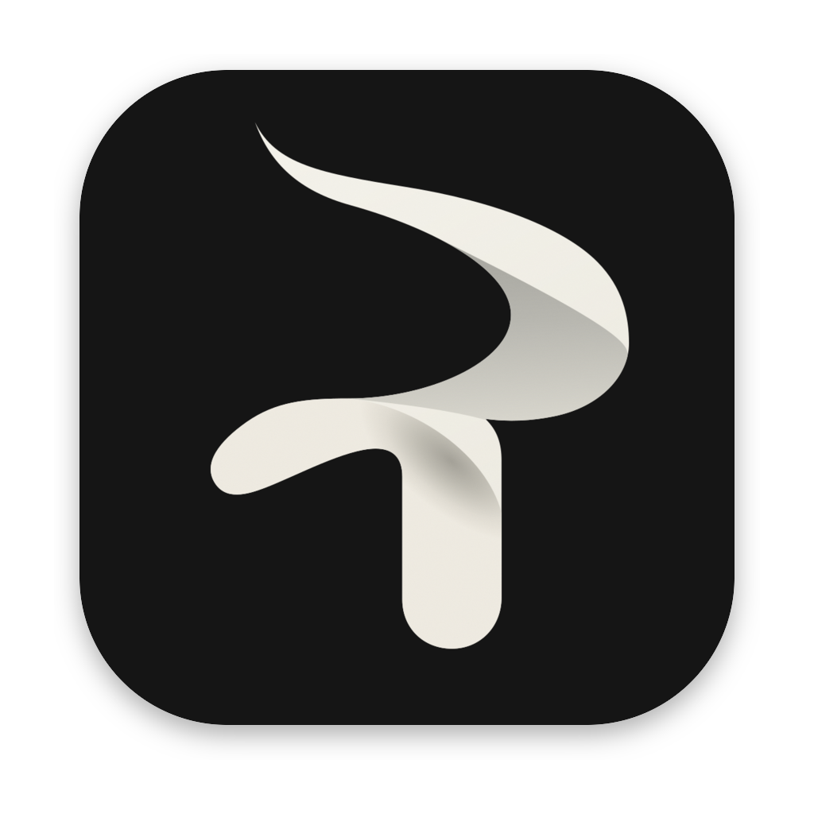

# Tokify

> An end-to-end encrypted time tracker for macOS — for individuals and teams.

<p align="center">
  
</p>

<p align="center">
  <a href="https://github.com/relegate-to/tokify/releases">
    
  </a>
  <a href="LICENSE">
    
  </a>
  
</p>

Tokify is an end-to-end encrypted time tracker for macOS. Use it privately on
your own or with a team: shared activities sync to every team member, while the
sync service cannot read what you worked on.

The desktop app is where you start and stop activities, browse your history,
and understand time by project. The menu bar is a compact timer and status view
that stays visible while you work.

The desktop app stores activities locally in SQLite. Existing `~/.tock.txt`
history is imported automatically the first time Tokify opens an empty database;
the original file is left untouched as a backup.

## Encrypted sync and teams

Encrypted sync is opt-in. Activities are encrypted on your device before they
leave it, so the sync service never sees what you or your team worked on.
Everyone on a team shares the same activity history: when one person updates
an activity, it is synced to the other team members.

For local-only tracking, simply keep using Tokify without enabling sync.

## Install

### macOS — one-liner

```sh
curl -fsSL https://raw.githubusercontent.com/relegate-to/tokify/main/install.sh | sh
```

This downloads the latest release, unpacks `Tokify.app` into `/Applications`, and
clears the macOS quarantine flag so it opens cleanly the first time.

### macOS — manual

1. Grab `Tokify-<version>-macos-universal.zip` from the
   [Releases page](https://github.com/relegate-to/tokify/releases/latest).
2. Unzip and drag `Tokify.app` into `/Applications`.
3. On first launch macOS may warn that the app is from an unidentified
   developer (Tokify is not yet signed with an Apple Developer ID). Either:
   - Right-click `Tokify.app` → **Open** → **Open** in the confirmation dialog, or
   - Run `xattr -dr com.apple.quarantine /Applications/Tokify.app` once.

### Build from source

You'll need Go (matching `go.mod`), Node 18+, and the [Wails CLI][wails]:

```sh
go install github.com/wailsapp/wails/v2/cmd/wails@latest
git clone https://github.com/relegate-to/tokify
cd tokify
make desktop-build-universal
open cmd/tock-desktop/build/bin/Tokify.app
```

`make desktop-doctor` will verify the toolchain is ready.

## In the app

The menu bar shows `● 0:42` while tracking and `○` when idle. Open the desktop
app to start an activity, review your timeline, explore reports, manage
projects, and configure encrypted team sharing and account settings.

## Command line

Tokify also has a scriptable CLI backed by the same SQLite database as the
desktop app. Build it locally with `make cli-build` (which creates
`bin/tokify`) or install it on your `PATH` with `make cli-install`.

```sh
tokify start "Client work" "Draft proposal"
tokify current
tokify stop
tokify last
```

Completed entries can be managed without opening the app. Times accept `HH:MM`,
`YYYY-MM-DD HH:MM`, or RFC 3339; `list` prints exact start timestamps for edits
and deletions. Mutations reject overlapping or future entries, and deletion
requires an explicit `--yes`.

```sh
tokify add --start "2026-09-24 13:00" --duration 45m "Admin" "Submit expenses"
tokify list --date 2026-09-24 --project "Admin"
tokify edit --note "Receipt batch 4" "2026-09-24T13:00:00+09:00"
tokify remove --yes "2026-09-24T13:00:00+09:00"
```

`watch` is designed for status bars and other desktop widgets. A normal call
prints only the current elapsed time and exits, so it is cheap to poll:

```sh
$ tokify watch
00:42:17
```

When idle it prints nothing and exits successfully. Use `--idle`, `--json`, or
`--format` when the consumer needs an explicit or richer status; use `--follow`
to stream an updated line every second instead of polling:

```sh
tokify watch --idle "--:--:--"
tokify watch --format '{{.Project}} · {{.Description}} · {{.Duration}}'
tokify watch --follow --interval 5s
```

Run `tokify help` or `tokify <command> --help` for the complete command list.
`TOKIFY_PROFILE` selects the same development profile as the desktop app, and
`TOKIFY_DATABASE` can point the CLI at a different database explicitly.

## Export

From the menu in the top-right of the window, you can export your activity log
as **CSV**, **JSON**, or plain **TXT**. You can scope the export to a date
range and an optional project. The resulting file is saved wherever you like —
handy for invoicing, reporting, or piping into a spreadsheet.

## Data

- Desktop activity database: `~/.tock.db` (SQLite)
- Legacy import source: `~/.tock.txt` (read once when the database is empty and
  then retained as a backup)

When encrypted sync is enabled, shared activity data is kept up to date for your
team without making that activity history readable to the sync service.

## Relationship to tock

Tokify began as a desktop fork of
[**tock**][tock] by [Vladimir Kriuchkov][kriuchkov].
It retains the original domain model and GPL-3.0-or-later license, but now ships
the Tokify macOS app and `tokify` CLI rather than the old `tock` product. See
[`TOKIFY.md`](TOKIFY.md) for attribution details.

## Development

```sh
make desktop-dev     # Wails dev server with hot reload
make desktop-build   # host-architecture .app, fast incremental
make desktop-build-universal   # arm64 + amd64 fat binary
make cli-build       # build bin/tokify
make cli-install     # install tokify on your Go binary path
make test            # Go tests (runs in Docker)
make linter          # golangci-lint (runs in Docker)
```

The frontend (`cmd/tock-desktop/frontend/`) is React + TypeScript with
Tailwind v4 and shadcn/ui. Backend bindings are auto-generated by Wails into
`frontend/wailsjs/`.

More notes for working on the desktop app are in
[`cmd/tock-desktop/README.md`](cmd/tock-desktop/README.md).

## License

GPL-3.0-or-later, inherited from upstream tock. See [`LICENSE`](LICENSE).

[tock]: https://github.com/kriuchkov/tock
[kriuchkov]: https://github.com/kriuchkov
[wails]: https://wails.io
